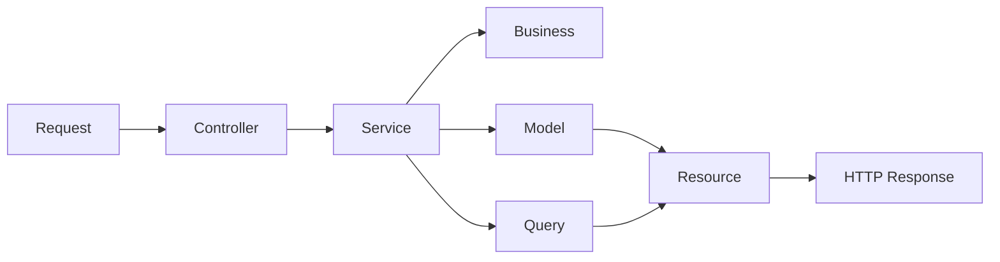

<p align="center">
  
</p>

<h1 align="center">M3L for Laravel</h1>

<p align="center">
  <a href="./README.md">Language Portal</a> •
  <a href="./README.pt-BR.md">Português (BR)</a>
</p>

Implementation of the **M3L — Modular in 3 Layers** pattern for Laravel backend applications.

M3L organizes the application by **business modules**, and each module is divided into **three main layers**: `Http`, `Domain`, and `Infrastructure`. Its goal is to build clearer, more cohesive, predictable, and sustainable backends by using Laravel with architectural discipline.

---

## Table of Contents

- [Overview](#overview)
- [Core Principle](#core-principle)
- [Base Structure](#base-structure)
- [Architectural Flow](#architectural-flow)
- [Layer Responsibilities](#layer-responsibilities)
- [Practical Example](#practical-example)
- [Cross-Module Queries](#cross-module-queries)
- [Mandatory Conventions](#mandatory-conventions)
- [Mental Checklist](#mental-checklist)
- [What Is Allowed / What Should Not Be the Default](#what-is-allowed--what-should-not-be-the-default)
- [Controlled Extensibility](#controlled-extensibility)
- [Repository Purpose](#repository-purpose)
- [License](#license)

---

## Overview

M3L is not just a way to organize folders. It defines a disciplined way to use Laravel without letting the framework’s convenience dilute architectural clarity.

In this pattern, the project is organized by **functional contexts**, not by global technical dumping grounds such as `app/Services` or `app/Models`.

> The logic is simple: the module is the main organizational unit; layers exist inside it to separate responsibilities.

---

## Core Principle

> **Module first, layer after.**

The M3L architectural flow can be summarized like this:

- **Controllers receive**
- **Services orchestrate**
- **Business decides**
- **Models persist**
- **Queries read and compose data**

This principle reduces coupling, improves readability, and makes it harder for the project to turn into a pile of “ownerless” classes.

---

## Base Structure

```txt
app/
  Modules/
    Companies/
      Http/
        Controllers/
        Requests/
        Resources/
      Domain/
        Services/
        Business/
        Enums/
      Infrastructure/
        Models/
        Queries/
```

Each module concentrates its HTTP entrypoint, orchestration, business rules, canonical persistence, and read queries.

### Quick Reading of the Structure

| Layer | Role |
|---|---|
| `Http` | Application input and output |
| `Domain` | Orchestration and business rules |
| `Infrastructure` | Persistence and queries |

---

## Architectural Flow



### Flow Summary

**Request -> Controller -> Service -> Business -> Model / Query -> Resource**

- **Request** validates the input
- **Controller** receives and delegates
- **Service** orchestrates the use case
- **Business** concentrates pure rules
- **Model** represents canonical persistence
- **Query** resolves reading, filtering, and joins
- **Resource** transforms the HTTP output

---

## Layer Responsibilities

### Http

Responsible for application input and output.

| Element | Responsibility | Can use | Should not do |
|---|---|---|---|
| `Controllers` | Receive the request and delegate the use case | Dependency injection, invokable controllers, `Resource`, `JsonResponse` | Business rules, complex queries, direct writes through Model |
| `Requests` | Validate and authorize HTTP input | `FormRequest`, validation rules, `authorize()` | Domain business rules, heavy queries, persistence |
| `Resources` | Transform API output | `JsonResource`, payload standardization | Query the database, define rules, mutate state |

### Domain

Responsible for orchestration and business rules.

| Element | Responsibility | Can use | Should not do |
|---|---|---|---|
| `Services` | Orchestrate the use case | `DB::transaction()`, `Business`, `Models`, `Queries` | Become a giant class holding all system rules |
| `Business` | Concentrate pure domain rules | Plain PHP, enums, arrays, neutral objects | Know `Models`, `Queries`, `Controllers`, or another `Business` |
| `Enums` | Represent controlled states | Native PHP `enum` | Spread magic strings across the system |

### Infrastructure

Responsible for persistence and queries.

| Element | Responsibility | Can use | Should not do |
|---|---|---|---|
| `Models` | Represent canonical module persistence | Eloquent, casts, fillable, simple local scopes | Hold business flow or duplicate another module’s table |
| `Queries` | Resolve reads, filters, joins, and reports | Query Builder, pagination, data composition | Transactional writes and business rule decisions |

---

## Practical Example

### `Companies` Module Structure

```txt
app/Modules/Companies/
  Http/
    Controllers/
      CompanySaveController.php
    Requests/
      CompanySaveRequest.php
    Resources/
      CompanyResource.php
  Domain/
    Services/
      CompanySaveService.php
    Business/
      CompanyValidationBusiness.php
    Enums/
      CompanyStatus.php
  Infrastructure/
    Models/
      Company.php
    Queries/
      CompanyListQuery.php
```

### Complete Module Example

<details>
<summary><strong>CompanySaveController.php</strong></summary>

```php
<?php

namespace App\Modules\Companies\Http\Controllers;

use App\Http\Controllers\Controller;
use App\Modules\Companies\Domain\Services\CompanySaveService;
use App\Modules\Companies\Http\Requests\CompanySaveRequest;
use App\Modules\Companies\Http\Resources\CompanyResource;

class CompanySaveController extends Controller
{
    public function __construct(
        private readonly CompanySaveService $service
    ) {}

    public function __invoke(CompanySaveRequest $request): CompanyResource
    {
        $company = $this->service->handle($request->validated());

        return new CompanyResource($company);
    }
}
```

</details>

<details>
<summary><strong>CompanySaveRequest.php</strong></summary>

```php
<?php

namespace App\Modules\Companies\Http\Requests;

use Illuminate\Foundation\Http\FormRequest;

class CompanySaveRequest extends FormRequest
{
    public function authorize(): bool
    {
        return true;
    }

    public function rules(): array
    {
        return [
            'name' => ['required', 'string', 'max:255'],
            'document' => ['required', 'string', 'max:20'],
            'type' => ['required', 'string', 'max:50'],
        ];
    }
}
```

</details>

<details>
<summary><strong>CompanyResource.php</strong></summary>

```php
<?php

namespace App\Modules\Companies\Http\Resources;

use Illuminate\Http\Request;
use Illuminate\Http\Resources\Json\JsonResource;

class CompanyResource extends JsonResource
{
    public function toArray(Request $request): array
    {
        return [
            'id' => $this->id,
            'uuid' => $this->uuid,
            'name' => $this->name,
            'document' => $this->document,
            'type' => $this->type,
            'status' => $this->status,
        ];
    }
}
```

</details>

<details>
<summary><strong>CompanySaveService.php</strong></summary>

```php
<?php

namespace App\Modules\Companies\Domain\Services;

use App\Modules\Companies\Domain\Business\CompanyValidationBusiness;
use App\Modules\Companies\Domain\Enums\CompanyStatus;
use App\Modules\Companies\Infrastructure\Models\Company;
use Illuminate\Support\Facades\DB;
use Illuminate\Support\Str;

class CompanySaveService
{
    public function __construct(
        private readonly CompanyValidationBusiness $validationBusiness
    ) {}

    public function handle(array $data): Company
    {
        $this->validationBusiness->validateForSave(
            document: $data['document'],
            type: $data['type'],
        );

        return DB::transaction(function () use ($data) {
            return Company::create([
                'uuid' => (string) Str::uuid(),
                'name' => $data['name'],
                'document' => $data['document'],
                'type' => $data['type'],
                'status' => CompanyStatus::PENDING->value,
            ]);
        });
    }
}
```

</details>

<details>
<summary><strong>CompanyValidationBusiness.php</strong></summary>

```php
<?php

namespace App\Modules\Companies\Domain\Business;

use DomainException;

class CompanyValidationBusiness
{
    public function validateForSave(string $document, string $type): void
    {
        if (trim($document) === '') {
            throw new DomainException('Company document is required.');
        }

        if (! in_array($type, ['generator', 'operator', 'manager', 'manufacturer'], true)) {
            throw new DomainException('Invalid company type.');
        }
    }
}
```

</details>

<details>
<summary><strong>CompanyStatus.php</strong></summary>

```php
<?php

namespace App\Modules\Companies\Domain\Enums;

enum CompanyStatus: string
{
    case PENDING = 'pending';
    case APPROVED = 'approved';
    case REJECTED = 'rejected';
}
```

</details>

<details>
<summary><strong>Company.php</strong></summary>

```php
<?php

namespace App\Modules\Companies\Infrastructure\Models;

use Illuminate\Database\Eloquent\Model;

class Company extends Model
{
    protected $table = 'companies';

    protected $fillable = [
        'uuid',
        'name',
        'document',
        'type',
        'status',
    ];
}
```

</details>

<details>
<summary><strong>CompanyListQuery.php</strong></summary>

```php
<?php

namespace App\Modules\Companies\Infrastructure\Queries;

use Illuminate\Support\Collection;
use Illuminate\Support\Facades\DB;

class CompanyListQuery
{
    public function handle(array $filters = []): Collection
    {
        $query = DB::table('companies')
            ->select(['id', 'uuid', 'name', 'document', 'type', 'status']);

        if (! empty($filters['status'])) {
            $query->where('status', $filters['status']);
        }

        if (! empty($filters['name'])) {
            $query->where('name', 'like', '%' . $filters['name'] . '%');
        }

        return $query->orderBy('name')->get();
    }
}
```

</details>

### What the Example Demonstrates

- Thin controller
- Request validating input
- Action-oriented service with `handle()`
- Pure business logic
- Canonical model
- Query dedicated to reads

In other words: each piece in its proper place, without Laravel turning everything into a soup of friendly helpers that become hard to govern.

---

## Cross-Module Queries

In M3L, cross-module reads should be resolved through **Queries**, not through structural coupling via Eloquent relationships as the main strategy.

### Practical Rule

- **The Model belongs to the owning module**
- **The join belongs to the Query**
- **Cross-module reading can use Query Builder with no guilt**
- **Cross-module Eloquent relationships are not the architectural default**

### Example

```php
<?php

namespace App\Modules\Documents\Infrastructure\Queries;

use Illuminate\Support\Collection;
use Illuminate\Support\Facades\DB;

class DocumentWithCompanyListQuery
{
    public function handle(array $filters = []): Collection
    {
        $query = DB::table('documents as d')
            ->join('companies as c', 'c.id', '=', 'd.company_id')
            ->select([
                'd.id',
                'd.uuid',
                'd.type',
                'd.number',
                'd.status',
                'c.id as company_id',
                'c.name as company_name',
            ]);

        if (! empty($filters['status'])) {
            $query->where('d.status', $filters['status']);
        }

        return $query->get();
    }
}
```

---

## Mandatory Conventions

| Element | Rule |
|---|---|
| Controllers | Invokable and action-oriented |
| Services | A single public method called `handle()` |
| Business | Must not know `Model`, `Query`, or another `Business` |
| Models | One canonical model per table, always in the owning module |
| Queries | Reads, filters, reports, and joins |

---

## Mental Checklist

When creating a new flow, use this triage:

- Is this HTTP input? Then it goes in `Http`
- Does this orchestrate a use case? Then it goes in `Domain/Services`
- Is this pure business rule? Then it goes in `Domain/Business`
- Does this represent a controlled state? Then it goes in `Domain/Enums`
- Is this canonical persistence? Then it goes in `Infrastructure/Models`
- Is this a read, filter, report, or join? Then it goes in `Infrastructure/Queries`

---

## What Is Allowed / What Should Not Be the Default

### Allowed

- Service calling Business, using Model, and opening a transaction
- Request validating payload format and required fields
- Resource transforming API output
- Query performing joins, filters, and reports
- Enum representing status, type, and category

### Should Not Be the Default

- Controller using Model directly or concentrating business rules
- Business accessing the database or knowing Query
- Duplicating the same table’s Model across different modules
- Using cross-module Eloquent relationships as the main strategy
- Service turning into a giant file with everything inside it

---

## Controlled Extensibility

M3L allows additional subdirectories inside layers when there is a real and justifiable technical need, for example:

- `Helpers`
- `Mappers`
- `Factories`
- `Validators`
- `Integrations`

### Rules for Creating Subdirectories

- Solve a clear and recurring responsibility
- Do not duplicate the role of `Services`, `Business`, `Models`, or `Queries`
- Do not become a generic folder for code “without a place”
- Be accepted as a project convention

### External Integrations Inside the Module

When a module depends on external services specific to its own context, the integration should remain inside the module itself, in `Infrastructure/Integrations`.

```txt
app/Modules/Documents/Infrastructure/Integrations/
  AzureDocumentIntelligenceClient.php
  OpenAiDocumentAnalysisClient.php
```

This approach avoids premature granularity and keeps the integration close to the domain that uses it.

---

## Repository Purpose

This repository exists to document and exemplify the application of the M3L pattern in the Laravel ecosystem, serving as a reference for:

- new project architecture
- team standardization
- technical onboarding
- code review
- building modular and sustainable backends

---

## License

This documentation is licensed under the
[Creative Commons Attribution 4.0 International License (CC BY 4.0)](https://creativecommons.org/licenses/by/4.0/).
