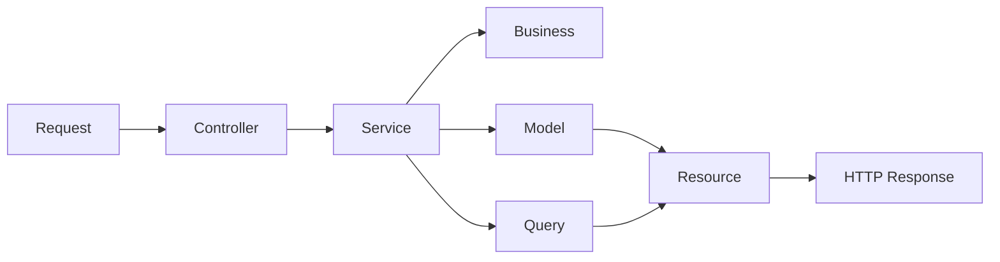

# M3L for Laravel

Implementação do padrão **M3L — Modular in 3 Layers** para aplicações backend com Laravel.

O M3L organiza a aplicação por **módulos de negócio**, e cada módulo é dividido em **três camadas principais**: `Http`, `Domain` e `Infrastructure`. O objetivo é construir backends mais claros, coesos, previsíveis e sustentáveis, usando Laravel com disciplina arquitetural.

---

## Sumário

- [Visão geral](#visão-geral)
- [Princípio central](#princípio-central)
- [Estrutura base](#estrutura-base)
- [Fluxo arquitetural](#fluxo-arquitetural)
- [Responsabilidades por camada](#responsabilidades-por-camada)
- [Exemplo prático](#exemplo-prático)
- [Consultas cross-module](#consultas-cross-module)
- [Convenções obrigatórias](#convenções-obrigatórias)
- [Checklist mental](#checklist-mental)
- [Pode / não deve ser padrão](#pode--não-deve-ser-padrão)
- [Extensibilidade controlada](#extensibilidade-controlada)
- [Objetivo deste repositório](#objetivo-deste-repositório)
- [Licença](#licença)

---

## Visão geral

O M3L não é apenas uma forma de organizar pastas. Ele define um modo disciplinado de usar o Laravel sem deixar que a conveniência do framework dilua a clareza da arquitetura.

Neste padrão, o projeto é organizado por **contextos funcionais**, e não por depósitos técnicos globais como `app/Services` ou `app/Models`.

> A lógica é simples: o módulo é a unidade principal de organização; as camadas existem dentro dele para separar responsabilidades.

---

## Princípio central

> **Módulo primeiro, camada depois.**

O fluxo arquitetural do M3L pode ser resumido assim:

- **Controllers recebem**
- **Services orquestram**
- **Business decide**
- **Models persistem**
- **Queries leem e cruzam dados**

Esse princípio reduz acoplamento, melhora a leitura do código e dificulta que o projeto se transforme em um amontoado de classes “sem dono”.

---

## Estrutura base

```txt
app/
  Modules/
    Companies/
      Http/
        Controllers/
        Requests/
        Resources/
      Domain/
        Services/
        Business/
        Enums/
      Infrastructure/
        Models/
        Queries/
```

Cada módulo concentra sua entrada HTTP, sua orquestração, sua regra de negócio, sua persistência canônica e suas consultas de leitura.

### Leitura rápida da estrutura

| Camada | Papel |
|---|---|
| `Http` | Entrada e saída da aplicação |
| `Domain` | Orquestração e regra de negócio |
| `Infrastructure` | Persistência e consultas |

---

## Fluxo arquitetural



### Resumo do fluxo

**Request -> Controller -> Service -> Business -> Model / Query -> Resource**

- **Request** valida a entrada
- **Controller** recebe e delega
- **Service** orquestra o caso de uso
- **Business** concentra regra pura
- **Model** representa a persistência canônica
- **Query** resolve leitura, filtros e joins
- **Resource** transforma a saída HTTP

---

## Responsabilidades por camada

### Http

Responsável pela entrada e saída da aplicação.

| Elemento | Responsabilidade | Pode usar | Não deve fazer |
|---|---|---|---|
| `Controllers` | Receber a requisição e delegar o caso de uso | Injeção de dependência, controllers invocáveis, `Resource`, `JsonResponse` | Regra de negócio, query complexa, escrita direta no Model |
| `Requests` | Validar e autorizar a entrada HTTP | `FormRequest`, regras de validação, `authorize()` | Regra de negócio, consulta pesada, persistência |
| `Resources` | Transformar a saída da API | `JsonResource`, padronização de payload | Consultar banco, montar regra, mutar estado |

### Domain

Responsável pela orquestração e pelas regras de negócio.

| Elemento | Responsabilidade | Pode usar | Não deve fazer |
|---|---|---|---|
| `Services` | Orquestrar o caso de uso | `DB::transaction()`, `Business`, `Models`, `Queries` | Virar classe gigante com toda a regra do sistema |
| `Business` | Concentrar regra pura do domínio | PHP puro, enums, arrays, objetos neutros | Conhecer `Models`, `Queries`, `Controllers` ou outro `Business` |
| `Enums` | Representar estados controlados | `enum` nativo do PHP | Espalhar strings mágicas pelo sistema |

### Infrastructure

Responsável pela persistência e pelas consultas.

| Elemento | Responsabilidade | Pode usar | Não deve fazer |
|---|---|---|---|
| `Models` | Representar a persistência canônica do módulo | Eloquent, casts, fillable, escopos simples | Concentrar fluxo de negócio ou duplicar tabela de outro módulo |
| `Queries` | Resolver leitura, filtros, joins e relatórios | Query Builder, paginação, composição de dados | Escrita transacional e decisão de regra |

---

## Exemplo prático

### Estrutura do módulo `Companies`

```txt
app/Modules/Companies/
  Http/
    Controllers/
      CompanySaveController.php
    Requests/
      CompanySaveRequest.php
    Resources/
      CompanyResource.php
  Domain/
    Services/
      CompanySaveService.php
    Business/
      CompanyValidationBusiness.php
    Enums/
      CompanyStatus.php
  Infrastructure/
    Models/
      Company.php
    Queries/
      CompanyListQuery.php
```

### Exemplo completo do módulo

<details>
<summary><strong>CompanySaveController.php</strong></summary>

```php
<?php

namespace App\Modules\Companies\Http\Controllers;

use App\Http\Controllers\Controller;
use App\Modules\Companies\Domain\Services\CompanySaveService;
use App\Modules\Companies\Http\Requests\CompanySaveRequest;
use App\Modules\Companies\Http\Resources\CompanyResource;

class CompanySaveController extends Controller
{
    public function __construct(
        private readonly CompanySaveService $service
    ) {}

    public function __invoke(CompanySaveRequest $request): CompanyResource
    {
        $company = $this->service->handle($request->validated());

        return new CompanyResource($company);
    }
}
```

</details>

<details>
<summary><strong>CompanySaveRequest.php</strong></summary>

```php
<?php

namespace App\Modules\Companies\Http\Requests;

use Illuminate\Foundation\Http\FormRequest;

class CompanySaveRequest extends FormRequest
{
    public function authorize(): bool
    {
        return true;
    }

    public function rules(): array
    {
        return [
            'name' => ['required', 'string', 'max:255'],
            'document' => ['required', 'string', 'max:20'],
            'type' => ['required', 'string', 'max:50'],
        ];
    }
}
```

</details>

<details>
<summary><strong>CompanyResource.php</strong></summary>

```php
<?php

namespace App\Modules\Companies\Http\Resources;

use Illuminate\Http\Request;
use Illuminate\Http\Resources\Json\JsonResource;

class CompanyResource extends JsonResource
{
    public function toArray(Request $request): array
    {
        return [
            'id' => $this->id,
            'uuid' => $this->uuid,
            'name' => $this->name,
            'document' => $this->document,
            'type' => $this->type,
            'status' => $this->status,
        ];
    }
}
```

</details>

<details>
<summary><strong>CompanySaveService.php</strong></summary>

```php
<?php

namespace App\Modules\Companies\Domain\Services;

use App\Modules\Companies\Domain\Business\CompanyValidationBusiness;
use App\Modules\Companies\Domain\Enums\CompanyStatus;
use App\Modules\Companies\Infrastructure\Models\Company;
use Illuminate\Support\Facades\DB;
use Illuminate\Support\Str;

class CompanySaveService
{
    public function __construct(
        private readonly CompanyValidationBusiness $validationBusiness
    ) {}

    public function handle(array $data): Company
    {
        $this->validationBusiness->validateForSave(
            document: $data['document'],
            type: $data['type'],
        );

        return DB::transaction(function () use ($data) {
            return Company::create([
                'uuid' => (string) Str::uuid(),
                'name' => $data['name'],
                'document' => $data['document'],
                'type' => $data['type'],
                'status' => CompanyStatus::PENDING->value,
            ]);
        });
    }
}
```

</details>

<details>
<summary><strong>CompanyValidationBusiness.php</strong></summary>

```php
<?php

namespace App\Modules\Companies\Domain\Business;

use DomainException;

class CompanyValidationBusiness
{
    public function validateForSave(string $document, string $type): void
    {
        if (trim($document) === '') {
            throw new DomainException('Company document is required.');
        }

        if (! in_array($type, ['generator', 'operator', 'manager', 'manufacturer'], true)) {
            throw new DomainException('Invalid company type.');
        }
    }
}
```

</details>

<details>
<summary><strong>CompanyStatus.php</strong></summary>

```php
<?php

namespace App\Modules\Companies\Domain\Enums;

enum CompanyStatus: string
{
    case PENDING = 'pending';
    case APPROVED = 'approved';
    case REJECTED = 'rejected';
}
```

</details>

<details>
<summary><strong>Company.php</strong></summary>

```php
<?php

namespace App\Modules\Companies\Infrastructure\Models;

use Illuminate\Database\Eloquent\Model;

class Company extends Model
{
    protected $table = 'companies';

    protected $fillable = [
        'uuid',
        'name',
        'document',
        'type',
        'status',
    ];
}
```

</details>

<details>
<summary><strong>CompanyListQuery.php</strong></summary>

```php
<?php

namespace App\Modules\Companies\Infrastructure\Queries;

use Illuminate\Support\Collection;
use Illuminate\Support\Facades\DB;

class CompanyListQuery
{
    public function handle(array $filters = []): Collection
    {
        $query = DB::table('companies')
            ->select(['id', 'uuid', 'name', 'document', 'type', 'status']);

        if (! empty($filters['status'])) {
            $query->where('status', $filters['status']);
        }

        if (! empty($filters['name'])) {
            $query->where('name', 'like', '%' . $filters['name'] . '%');
        }

        return $query->orderBy('name')->get();
    }
}
```

</details>

### O que o exemplo demonstra

- Controller magro
- Request validando entrada
- Service orientado a ação com `handle()`
- Business puro
- Model canônico
- Query dedicada à leitura

Ou seja: cada peça no seu quadrado, sem o Laravel transformar tudo em uma sopa de helpers simpáticos e difíceis de governar.

---

## Consultas cross-module

No M3L, leituras cruzadas entre módulos devem ser resolvidas por **Queries**, e não por acoplamento estrutural via relacionamento Eloquent como estratégia principal.

### Regra prática

- **Model pertence ao módulo dono**
- **Join pertence à Query**
- **Leitura cruzada pode usar Query Builder sem culpa**
- **Relacionamento Eloquent cross-module não é o padrão arquitetural**

### Exemplo

```php
<?php

namespace App\Modules\Documents\Infrastructure\Queries;

use Illuminate\Support\Collection;
use Illuminate\Support\Facades\DB;

class DocumentWithCompanyListQuery
{
    public function handle(array $filters = []): Collection
    {
        $query = DB::table('documents as d')
            ->join('companies as c', 'c.id', '=', 'd.company_id')
            ->select([
                'd.id',
                'd.uuid',
                'd.type',
                'd.number',
                'd.status',
                'c.id as company_id',
                'c.name as company_name',
            ]);

        if (! empty($filters['status'])) {
            $query->where('d.status', $filters['status']);
        }

        return $query->get();
    }
}
```

---

## Convenções obrigatórias

| Elemento | Regra |
|---|---|
| Controllers | Invocáveis e orientados a uma ação |
| Services | Um único método público chamado `handle()` |
| Business | Não conhece `Model`, `Query` ou outro `Business` |
| Models | Um Model canônico por tabela, sempre no módulo dono |
| Queries | Leitura, filtros, relatórios e joins |

---

## Checklist mental

Ao criar um novo fluxo, use esta triagem:

- Isso é entrada HTTP? Vai em `Http`
- Isso orquestra um caso de uso? Vai em `Domain/Services`
- Isso é regra pura do negócio? Vai em `Domain/Business`
- Isso representa estado controlado? Vai em `Domain/Enums`
- Isso é persistência canônica? Vai em `Infrastructure/Models`
- Isso é leitura, filtro, relatório ou join? Vai em `Infrastructure/Queries`

---

## Pode / não deve ser padrão

### Pode

- Service chamar Business, usar Model e abrir transação
- Request validar formato e obrigatoriedade do payload
- Resource transformar a saída da API
- Query fazer join, filtro e relatório
- Enum representar status, tipo e categoria

### Não deve ser padrão

- Controller usar Model direto ou concentrar regra de negócio
- Business acessar banco ou conhecer Query
- Duplicar Model da mesma tabela em módulos diferentes
- Usar relação Eloquent cross-module como estratégia principal
- Service virar arquivo gigante com tudo dentro

---

## Extensibilidade controlada

O M3L permite subdiretórios adicionais dentro das camadas quando houver necessidade técnica real e justificável, por exemplo:

- `Helpers`
- `Mappers`
- `Factories`
- `Validators`
- `Integrations`

### Regras para criar subdiretórios

- Resolver uma responsabilidade clara e recorrente
- Não duplicar o papel de `Services`, `Business`, `Models` ou `Queries`
- Não virar pasta genérica para código “sem lugar”
- Ser aceito como convenção do projeto

### Integrações externas no módulo

Quando um módulo depender de serviços externos específicos do seu próprio contexto, a integração deve permanecer dentro dele, em `Infrastructure/Integrations`.

```txt
app/Modules/Documents/Infrastructure/Integrations/
  AzureDocumentIntelligenceClient.php
  OpenAiDocumentAnalysisClient.php
```

Essa abordagem evita granularização prematura e mantém a integração próxima do domínio que a utiliza.

---

## Objetivo deste repositório

Este repositório existe para documentar e exemplificar a aplicação do padrão M3L no ecossistema Laravel, servindo como referência para:

- arquitetura de novos projetos
- padronização de times
- onboarding técnico
- revisão de código
- construção de backends modulares e sustentáveis

---

## Licença

Esta documentação está sob a licença
[Creative Commons Attribution 4.0 International License (CC BY 4.0)](https://creativecommons.org/licenses/by/4.0/).
